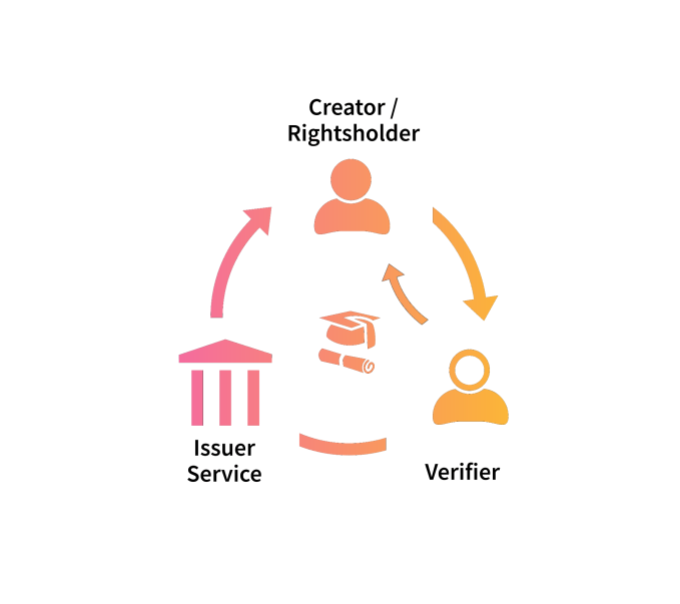

# Issuers, Holders, and Verifiers

<figure><figcaption></figcaption></figure>

## Credential issuers

In the context of the cultural and creative industries, any organisation or institution could potentially be an issuer of verifiable credentials and act as a trust service for attribution or assertions. &#x20;

Let’s have a look at a few examples of potential credential issuers:

* A **membership organisation** could issue VCs to their members;
* A **CMO** (collective management organisation or collecting society) or **PRO** (Performance Rights Organisation) could issue VCs to creators they represent;
* A **publisher** or media organisation could attest attribution of authors, photographers, and freelancers;
* **Digital distributors** are trusted and established intermediaries that usually represent a large number of rightsholders. They could act as trust service.&#x20;
* Any trusted media organisation or publicly known entity could issue VCs.

## Credential holders

Verifiable credentials have the potential to provide sufficient identification about the holders as the parties making content declarations, such as:

* Creators, i.e., writers, bloggers, photographers, journalists, musicians, etc.;
* Rightsholders, i.e., publishers, labels, intermediaries, retailers.

<table><thead><tr><th width="106"></th><th width="186">Creators</th><th width="208">Rightsholders</th><th>Intermediaries</th></tr></thead><tbody><tr><td><strong>Image</strong></td><td>Photographers</td><td>Stock photo platforms, publishers; photo licensing agencies</td><td>News agencies</td></tr><tr><td><strong>Audio</strong></td><td>Bands; singers / songwriters; podcasters</td><td>Record labels, music publishers, studios</td><td>Music distributors, CMOs</td></tr><tr><td><strong>Text</strong></td><td>Authors; independent journalists; bloggers</td><td>Literary Agencies; Publishers (academic, trade, educational, audiobook, news)</td><td>News and ebook distributors; libraries</td></tr><tr><td><strong>Video</strong></td><td>Vloggers</td><td>TV and video producers and broadcasters</td><td>Video distributors</td></tr></tbody></table>

## Credential verifiers

We see many use cases where parties might want to verify content, claims, and attribution.  Verifiers of VCs could be:

* Any user who wishes to authenticate the content declaration;
* A platform, such as an Online Content-Sharing Service Provider (OCSSP);
* Retailers and shops that require domain-specific identity confirmation or want to verify claims to content or attribution.
