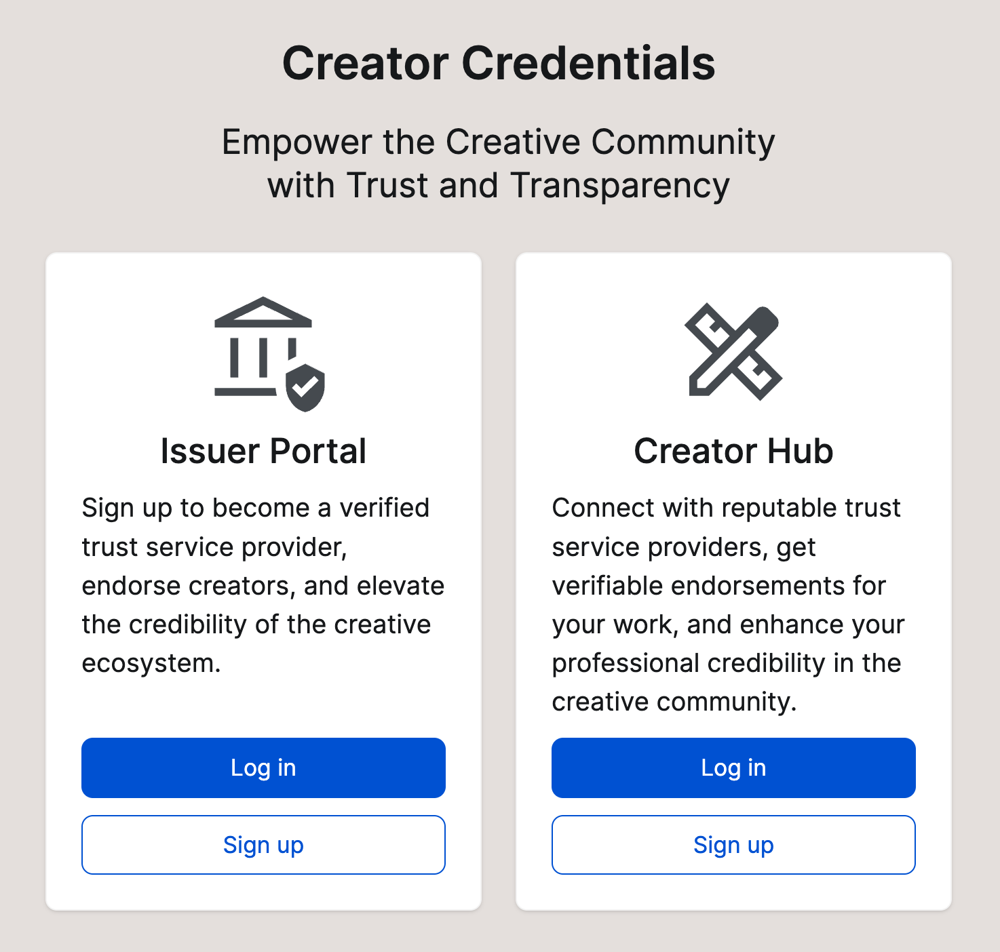

# User application

<figure><figcaption>
Landing page
</figcaption></figure>

The app will be based on new and upcoming ISO and W3C standards for decentralised content identification (ISCC), decentralised identifiers (DIDs), and verifiable credentials (VCs). It will be aligned with European regulations on digital identity, data privacy, and copyright, ensuring that all credentials issued and verified adhere to industry regulations and safeguard self-sovereign control over user data.

The app will be developed as an open-sourced, dockerised service that can be installed on premise by media organisations. It will facilitate the onboarding process, mutual authentication, and verification of credential issuers and creators. The app will support the creation and issuance of a variety of credential types and subjects, tailored to the specific needs of the various media sectors.

## Enter the construction site

Feel free to have a look at the visual interface of the Creator Credentials app:&#x20;


Creator Credentials app


Be aware that the application is still in development. Not all things be fully functional, but you can certainly click through the application and get a better idea what you can do either as a creator or as a trust service (credentials issuer). &#x20;
