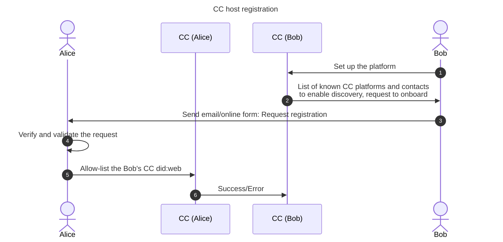

# CC issuers and hosts discovery <!-- omit in toc -->

- [CC host capabilities](#cc-host-capabilities)
- [CC discovery service](#cc-discovery-service)
  - [Data model](#data-model)
  - [Resolution](#resolution)
  - [Registration protocol](#registration-protocol)
- [Protocol details](#protocol-details)

Creator Credentials is a multi-tenant VC issuance service. We're introducing the following roles

- hosts - actors hosting the CC service
- issuers - actors who can issue VCs
- holders - actors who receive VCs

## CC host capabilities

- CC host must have did:web set up
- CC host must obtain a domain/did:web VC from the creatorcredentials.cc
- CC host can onboard other hosts
- CC host can enable/disable host/issuer discovery service

## CC discovery service

CC discovery service enables to request VCs from any issuer, no matter on which
CC platform it has been onboarded. CC discovery:

- discovers other CC hosts and issuers
- publishes information about itself, onboarded issuers, and discovered cc hosts

The information is published under 'did:web:<domain-name>/discovery.json'

### Data model

JSON schema is available [here](../json-schema/discovery/2023-11/schema.json). Example:

```json
{
  "version": 1,
  "lastUpdated": "2023-11-05T10:00:00Z",
  "knownHosts": [
    "did:web:alice.com",
    "did:web:bob.com"
  ],
  "issuers": [
    "did:web:charlie.com",
    "did:web:eve"
  ]
}
```

### Resolution

Resolution follows the did:web schema

- did:web:<domain.name> resolves to: <https://domain.name/.well-known/discovery.json>
- did:web:<domain.name>:<path> resolves to: <https://domain.name/path/discovery.json>

### Registration protocol

- I need to know that the official CC platform has been set up
- I need to register the new host



1. Bob sets up the platform
2. Bob is notified about the known CC platforms with registration capabilities
3. Bob sends an onboarding request to one of the platforms
4. Alice receives and verifies and validates the request
5. Alice allow-lists Bob's platform
6. Bob's did:web is added to the "known-hosts"

## Protocol details

At minimum, Bob needs to share its DID (did:web). Alice may require additional information about Bob's organisation. If Alice recognises Bob as a legit CC host, it adds Bob's did:web to her application.

Alice can, at any time, remove entities from the known-hosts list. List of issuers MUST be updated according to the activities on the platform.

CC platform checks 1/day with all known-hosts if there were any updates.
