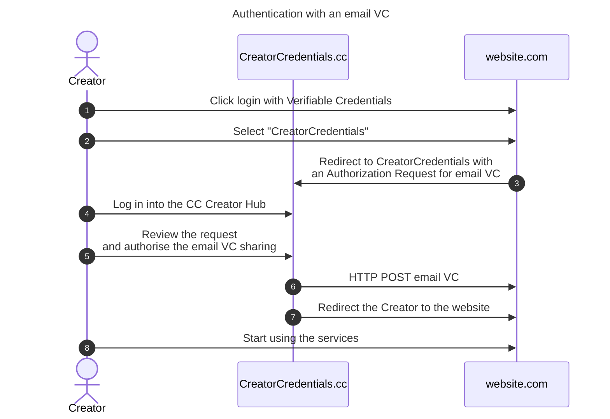

# Creator uses its Creator Credentials to log in <!-- omit in toc -->

- [Creator authenticates using its Creator VCs](#creator-authenticates-using-its-creator-vcs)
- [Verifiable Presentations profile](#verifiable-presentations-profile)

## Creator authenticates using its Creator VCs

Creators can use their Verifiable Credentials to log in into another platform that supports authentication with Verifiable Credentials. The sequence diagram summarises such flow.

1. A creator visits a website that supports authentication with Verifiable Credentials.
2. The creator selects to log in with CreatorCredentials.
3. The creator is redirected to the CreatorCredentials website. The redirect contains information about the "website.com" and what VCs they are requesting.
4. The creator authenticates with the CreatorCredentials (Creator Hub section).
5. The creator reviews the VC sharing request and either approves or denies it.
6. If the creator approves the VC sharing, a Verifiable Presentation is created and sent to the website's credential endpoint. See section [Verifiable Presentations](#verifiable-presentations)
7. The creator is redirected to the website.com
8. If the VC is valid, the creator can start using the services

Creator Credentials platform enables creators to authenticate with their email or other Verifiable Credentials. We are following the [EBSI profile](https://hub.ebsi.eu/conformance/build-solutions/holder-wallet-functional-flows) for Verifiable Credentials exchange.

## Verifiable Presentations profile

Verifiable Presentation data model is defined int the [W3C VC specifications](https://w3c.github.io/vc-data-model/#presentations-0). Verifiable Presentations are signed the same way as described in the [email VC issuance specifications](../creator-email-verification.md).
