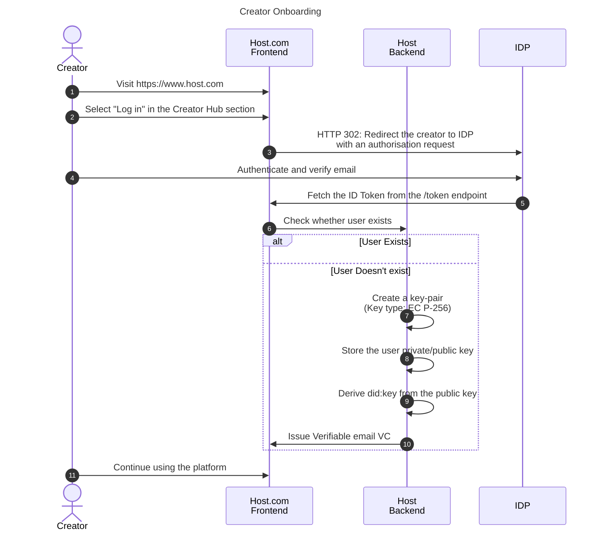

# Creator email verification <!-- omit in toc -->

- [Email verification process](#email-verification-process)
- [Keypair generation](#keypair-generation)
- [Private key security policies](#private-key-security-policies)
- [Key storage](#key-storage)
- [did:key](#didkey)
- [Verifiable Credentials](#verifiable-credentials)
- [Digital Signatures](#digital-signatures)

## Email verification process

This document describes the creator email verification.

1. Creator visits the website
2. The creator selects to log in into the Creator Hub section
3. The creator is redirected to the IDP Website
4. The creator authenticates and proves email ownership
5. Host obtains an ID Token from the IDP attesting user's emil
6. Check Check whether it is a new user
7. Create creator private-public keypair. See section [keypair generation](#keypair-generation)
8. Store the private key in the secure storage. See section [key storage](#key-storage).
9. Derive did:key as specified in section [did:key](#didkey)
10. Create email Verifiable Credential. See section [Verifiable Credentials](#verifiable-credentials)
11. Sign the Verifiable Credential. See section [digital signatures](#digital-signatures)
12. The creator gets access to the Creator Hub

## Keypair generation

The host application must generate an EC secp256r1 (alternative names: P-256, prime256v1) key pair for the creator. Any [library](https://jwt.io/libraries) supporting ES256 signature should be capable of generating such a key pair. The key pair must be accessible to the host application only when the user is authenticated for the purpose of authentication of presenting Verifiable Credentials.

Future versions will support signing with externally owned keys.

## Private key security policies

- The keys must not be exportable.
- The keys can only be accessible when the user is authenticated.
- The keys must be encrypted at rest.

Advanced

- The keys are stored in a hardware secured module.
- The keys are password protected.

## Key storage

Private keys must be stored in a secure database.

NOTE: For the self-hosted version, the database should not rely on a 3rd party IDP features.

## did:key

did:key DID method contains serialised and encoded public key. From DID we can obtain the full public key. We are following the EBSI profile of did:key.

Check the references below, before implementing the method.

- Create a DID from a public key <https://hub.ebsi.eu/vc-framework/did/did-methods/natural-person>
- Resolve public keys from did:key: <https://hub.ebsi.eu/tools/did-resolver>
  - See also the Source Code tab for implementation details

## Verifiable Credentials

Verifiable email VC is defined in the [json-schema](../json-schema/verification-credentials/email) directory.

Creator email credential is a private VC, hence it should not be publicly available.

## Digital Signatures

For Verification VCs we're using simple JWS signatures. JWS signatures MUST have header parameters as defined in [specifications](https://hub-test.ebsi.eu/vc-framework/jades). Any [library](https://jwt.io/libraries) that supports custom header claims can be used to create and validate the signature.

Payload is the VC as defined in the [json-schema](../json-schema/) directory.
