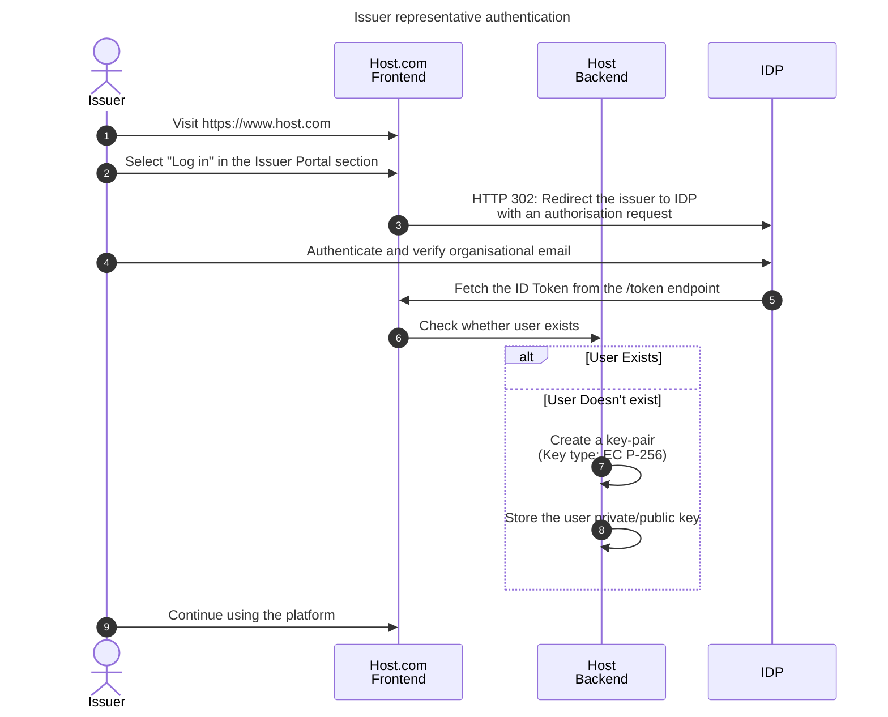

# Host - Issuer Onboarding

Issuer representatives must be able to authenticate with the host using their organisational email addresses.

Proposed solution: use a 3rd party Identity Provider (IDP) and user management system.

The sequence diagram presents a simple OIDC-based authentication flow. Implementation may differ, depending on the IDP capabilities.

1. Issuer visits the website
2. The issuer selects to log in into the Issuer Portal section
3. The issuer is redirected to the IDP Website
4. The issuer authenticates and proves email ownership
5. Host obtains an ID Token from the IDP attesting user's emil
6. Check Check whether it is a new user
7. Create issuer private-public keypair. See section [keypair generation](#keypair-generation)
8. Store the private key in the secure storage. See section [key storage](#key-storage).
9. The issuer gets access to the Issuer Portal

Only email login should be supported since we want users to authenticate with their organisational email addresses. Login with social media is not applicable.

After the user is authenticated, it needs to perform did:web verification, else we cannot assure the user belongs to the given organisation.

NOTE: Whether the user has the right to represent the organisation is out of scope for this version.

## Keypair generation

The host application must generate an EC secp256r1 (alternative names: P-256, prime256v1) key pair for the issuer. Any [library](https://jwt.io/libraries) supporting ES256 signature should be capable of generating such a key pair. The key pair must be accessible to the host application only when the user is authenticated for the purpose of authentication of presenting Verifiable Credentials.

Future versions will support signing with externally owned keys.

## Private key security policies

- The keys must not be exportable.
- The keys can only be accessible when the user is authenticated.
- The keys must be encrypted at rest.

Advanced

- The keys are stored in a hardware secured module.
- The keys are password protected.

## Key storage

Private keys must be stored in a secure database.

NOTE: For the self-hosted version, the database should not rely on a 3rd party IDP features.

## did:web

Once the issuer is authenticated, it MUST set up their did:web as defined in [Issuer did:web verification](issuer-did.md).
