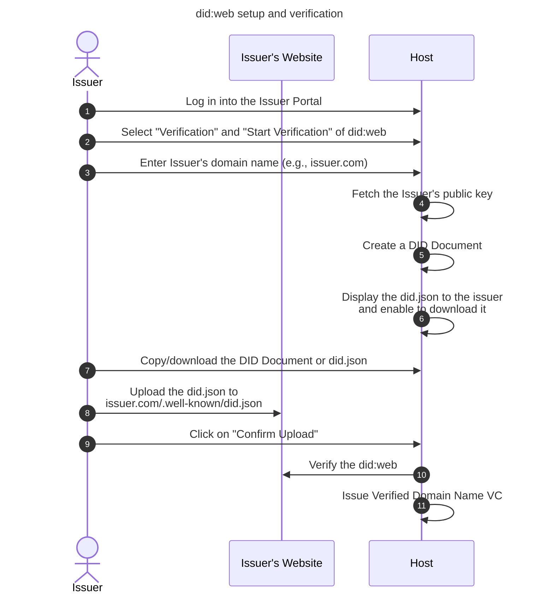
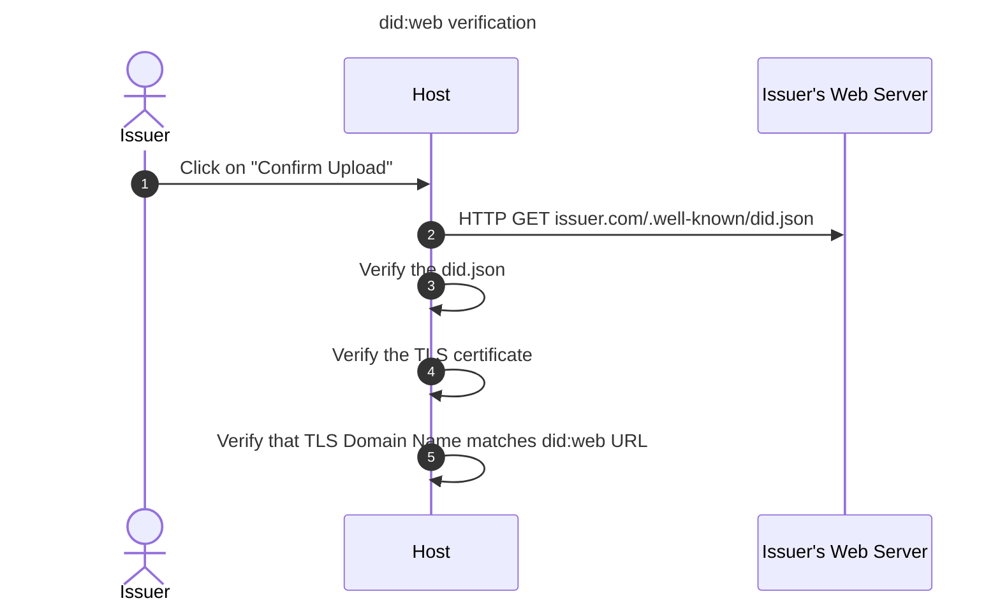

# Issuer Decentralised identifiers <!-- omit in toc -->

- [Create did:web](#create-didweb)
- [Issuer's Domain Name](#issuers-domain-name)
- [Obtaining issuers public key](#obtaining-issuers-public-key)
- [DID Document](#did-document)
- [did:web verification](#didweb-verification)
- [Verified Domain Name VC issuance](#verified-domain-name-vc-issuance)
  - [Verifiable Credentials](#verifiable-credentials)
  - [Digital Signatures](#digital-signatures)
- [Key management Policies](#key-management-policies)
- [References](#references)

This document summarises a did:web DID method profile of an issuer and the did:web verification process.

All issuers MUST support [did:web](https://w3c-ccg.github.io/did-method-web/) DID method. did:web allows to publish information about issuers's public keys via their own website.

## Create did:web

Issuer set up their did:web during the did:web verification process summarised below.

1. Issuer logs in into the Issuer Portal of the host
2. The issuer selects Verification section and Start Verification of the did:web
3. The issuer enters their domain name. See section [Issuer's Domain Name](#issuers-domain-name)
4. The host fetches issuer's public key from the key store. See [Obtaining issuer's public key](#obtaining-issuers-public-key)
5. The host generates a DID Document as described in [DID Document](#did-document) section.
6. The DID Document and did.json are available to issuer to download
7. The issuer can download or copy the DID Document
8. The issuer uploads the DID Document to their web server under the domain name provided in step 3.
9. The issuer clicks on "Confirm Upload"
10. The host verifies the did:web. See section [did:web verification](#didweb-verification)
11. The host issues Verified Domain Name VC. See section [Verified Domain Name VC issuance](#verified-domain-name-vc-issuance)

## Issuer's Domain Name

The issuer MUST enter a valid domain name with or without the http/https schema. The domain name can contain subdomains (dev.issuer.com), but MUST NOT contain any paths (issuer.com/dev).

The hostname MUST also match the hostname in the email, used to log in.

Recommendation: The input field should already contain the domain name and would optionally allow the user to enter a subdomain. For example: if the user logged in with <alice@issuer.com>, the input field can have the following structure `[Optional: Enter subdomain].issuer.com` where the user can only edit the `[Optional: Enter subdomain]` part.

## Obtaining issuers public key

Issuer's public keys are generated and stored as described in the [Issuer Onboarding](./host-issuer-authenticaiton.md) specifications.

## DID Document

- [Example DID Document](../examples/issuer.com/.well-known/did.json)
  - The DID Document MUST contain at least one public key: in this version we'll use only one public key
  - The DID Document MAY contain authentication claim
  - The DID Document MUST contain assertionMethod
    - The DID Document MUST reference the host's public key that's used to sign Verification VCs
- The DID Document MUST be stored in a did.json file under: `issuer.com/.well-known/did.json`
  - Optional: HTTP response header content type should be: `application/did+ld+json`. Content type `application/json` is also conformant with the did:web specification

## did:web verification

The host MUST verify issuer's did:web setup and with it the issuer's domain name.

Verification process is summarised below.

1. An issuer initiates the verification process
2. The host fetches the information from Issuer's Web Server
   1. The issuer's web server MUST return a valid JSON document
   2. HTTP response MUST be 200
   3. HTTP response header MUST contain either: application/json or application/did+ld+json
3. The host verifies the did.json
   1. did.json MUST contain a valid DID Document
   2. did:web:{issuer domain name}: issuer domain name must match the provided domain name in the input form
   3. If DID Document contains multiple public keys, one of the public keys MUST match the public key of the issuer at the host

## Verified Domain Name VC issuance

### Verifiable Credentials

Verifiable Domain Name VC is defined in the [json-schema](../json-schema/verification-credentials/domain-name/) directory.

Issuer VCs are public VCs, so they can be public.

### Digital Signatures

For Verification VCs we're using simple JWS signatures. JWS signatures MUST have header parameters as defined in [specifications](https://hub-test.ebsi.eu/vc-framework/jades). Any [library](https://jwt.io/libraries) that supports custom header claims can be used to create and validate the signature.

Payload is the VC as defined in the [json-schema](../json-schema/) directory.

## Key management Policies

- Keys in the DID Document MUST be considered valid
- Key rotation is performed by updating the DID Document
- Issuer is responsible for managing their DID Document. Failing to do so, may result with invalid VC verification.

## References

- [w3c did:web](https://w3c-ccg.github.io/did-method-web/)
