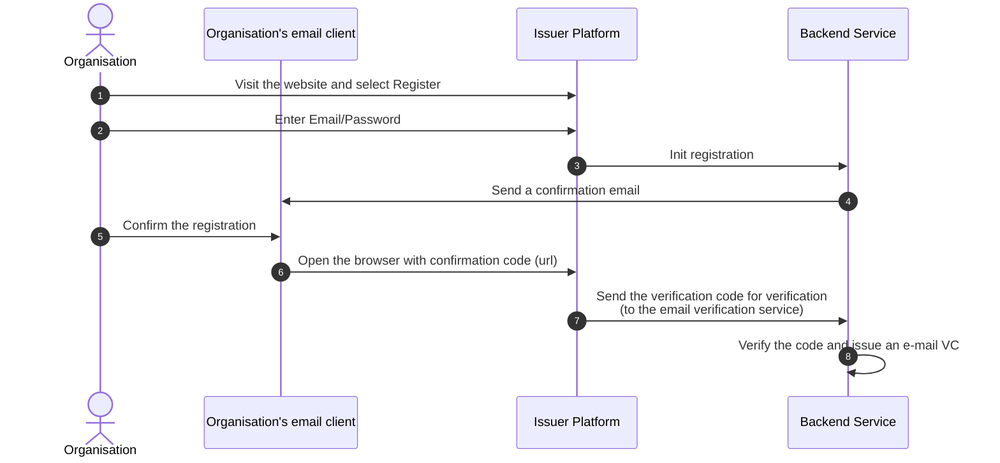
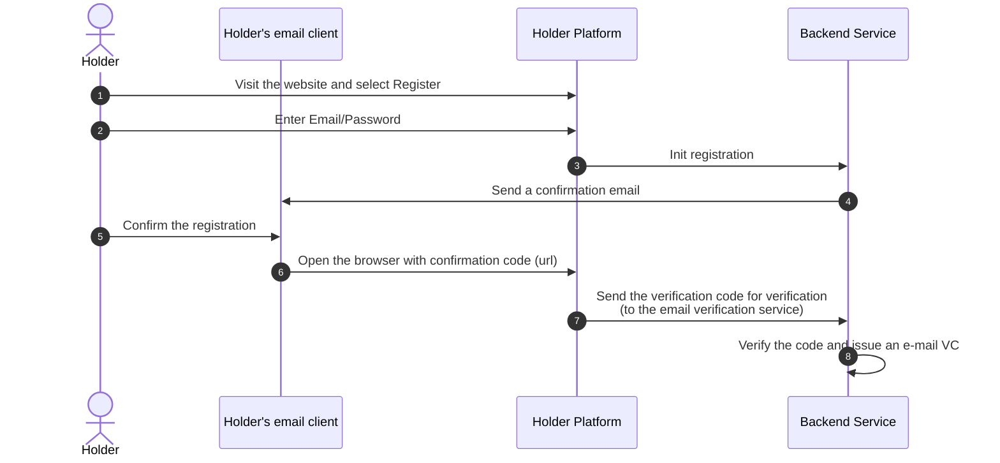

# User Journeys

Issuer:

- As an issuer I can register in into the platform using username and password or social media login (login with google/...)
- After I log in, I'm asked to confirm my email
- I can set my legal entity information
- I can select which Verifiable Credentials I can issue
- I can select which VCs the user needs to share in order to receive a VC
- I can receive a notification about a VC issuance request
- I can accept/reject the VC issuance

Holder:

- As a holder I can register in into the platform using username and password or social media login (login with google/...)

- I can select an issuer
  - Must be able to fetch the list of issuers
  - Demo: Pearson, Reuters
- I can select a VC I want to obtain
  - Must be able to fetch the list of VCs issuers are able to issue
    - Pearson: author VC, Employee VC
    - Reuters: author VC, Researcher VC
- I'm asked if I permit sharing one or more of my VCs
  - To get a VC, email VC must be shared
- I receive an email notification about pending VC issuance
- I receive an email notification about issued VCs
- I can accept the VC

